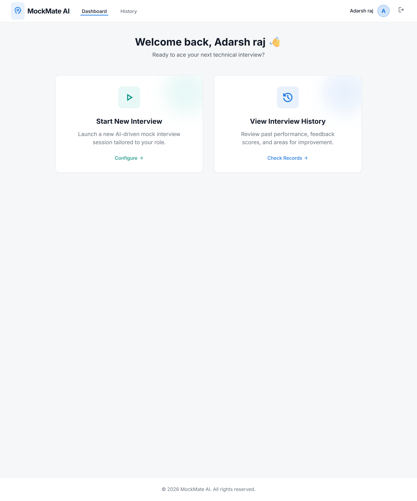
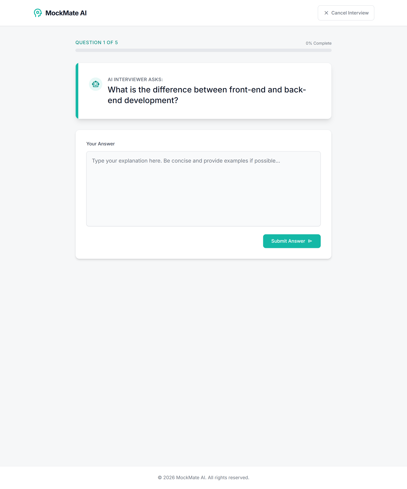
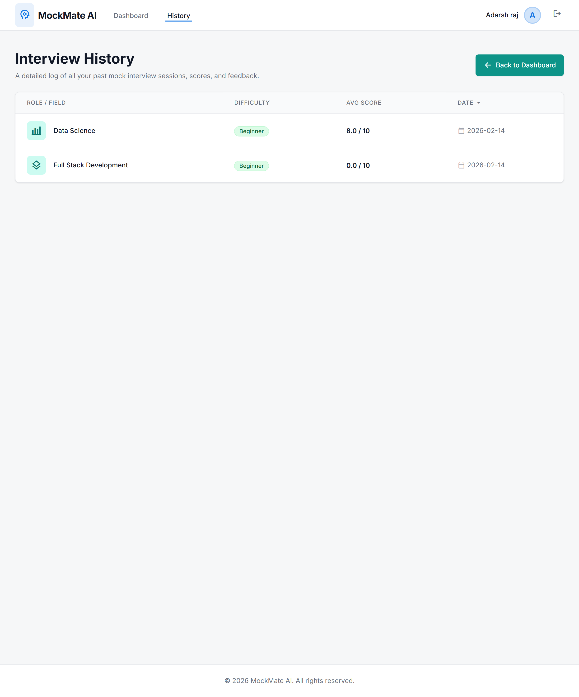

# MockMate AI - AI-Powered Interview Practice


**MockMate AI** is an intelligent interview preparation platform that uses Large Language Models (LLMs) to conduct realistic mock interviews. It generates tailored questions based on your field and difficulty level, evaluates your answers, and provides detailed feedback.

## 🌐 Live Demo

🚀 [Live App](https://mockmate-ai-n7mx.onrender.com)

## 🚀 Features

-   **Dynamic Question Generation**: AI generates unique questions for every session based on your chosen field (DevOps, AI/ML, Full Stack, etc.) and difficulty.
-   **Intelligent Evaluation**: Answers are analyzed for correctness, depth, and clarity.
-   **Detailed Feedback**: Get a score (0-10) along with strengths, weaknesses, and improvement tips.
-   **User Dashboard**: key statistics and interview history.
-   **Secure Authentication**: User registration and login system.
-   **Responsive Design**: Modern UI built with Tailwind CSS.

## 🛠️ Tech Stack

-   **Backend**: Python, Flask, Flask-Login, Flask-SQLAlchemy
-   **Database**: SQLite (Local)
-   **Frontend**: HTML5, Jinja2, Tailwind CSS (CDN)
-   **AI/LLM**: OpenAI API / Groq API (Configurable)

## 🏗️ System Architecture

1. User selects field and difficulty.
2. Backend sends structured prompt to LLM API.
3. LLM generates 5 interview questions.
4. User submits answers.
5. LLM evaluates answers and returns:
   - Score (0-10)
   - Strengths
   - Weaknesses
   - Suggestions
6. Results are stored in database.
7. User can track progress in dashboard.

## 📸 Screenshots

### 🏠 Dashboard


### 🎤 Interview Session


### 📊 Results & Feedback


### 📈 Interview History


## 📦 Installation

1.  **Clone the repository**:
    ```bash
    git clone https://github.com/adarsh1403/MockMate-AI.git
    cd MockMate-AI
    ```

2.  **Create a virtual environment**:
    ```bash
    python -m venv venv
    # Windows
    venv\Scripts\activate
    # Mac/Linux
    source venv/bin/activate
    ```

3.  **Install dependencies**:
    ```bash
    pip install -r requirements.txt
    ```

4.  **Configure Environment**:
    Create a `.env` file in the root directory:
    ```env
    SECRET_KEY=your-secret-key
    GROQ_API_KEY=your-api-key
    ```

5.  **Run the application**:
    ```bash
    python app.py
    ```

    Access the app at `http://127.0.0.1:5000`.

## 🔐 Security

- Passwords hashed using Werkzeug security utilities
- Environment variables for API keys
- Session-based authentication via Flask-Login

## 🤝 Contributing

Contributions are welcome! Please feel free to submit a Pull Request.

## 📄 License

This project is licensed under the MIT License - see the LICENSE file for details.
